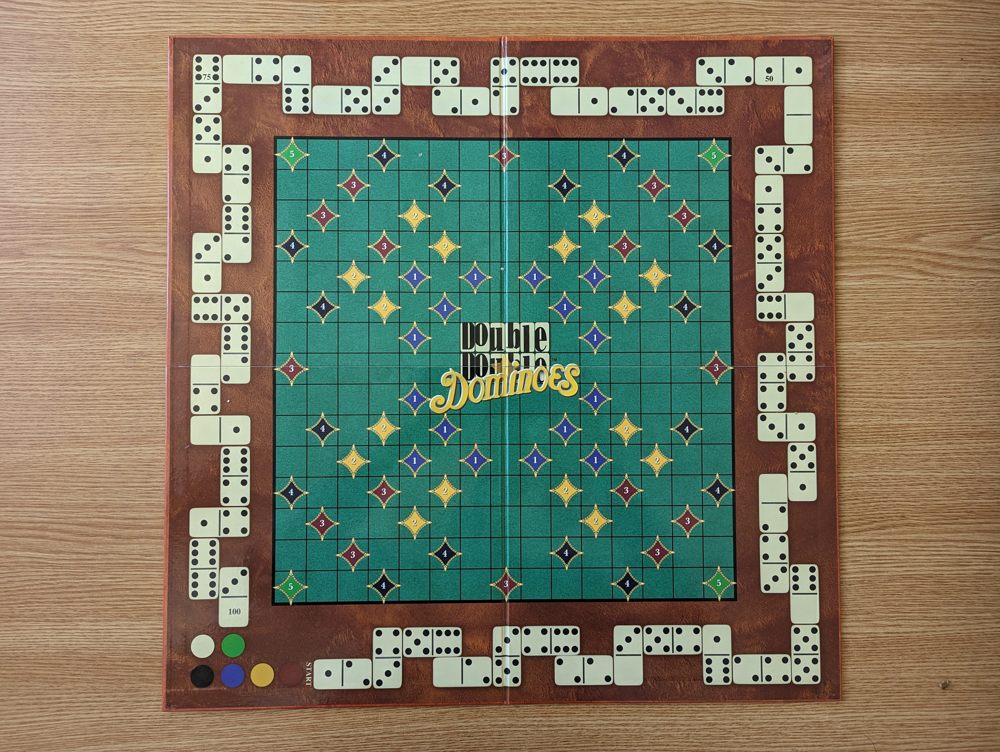

# Double-Double-Domino

## Objective
This project is a Computer Vision application designed to calculate scores for a Double Double Dominoes game from images of the board. The primary goal is to detect and analyze the placement of domino pieces on the board and compute scores based on their positions.

## Dominoes
Dominoes is a family of tile-based games played with gaming pieces. Each domino is a
rectangular tile, usually with a line dividing its face into two square ends. Each end is
marked with a number of dots (usually for 1 to 6) or is blank.

## Double Double Dominoes
Double Double Dominoes (DDD) is a specific variant of dominoes game that combines
ideas from the game of a Scrabble into a dominoes game (Figure 1). The object of the game
is to score points by building chains of dominoes that cover the diamonds on the board.
The farther you get from the center, the bigger the score is. The score can be increased by using double dominoes (domino tiles with the same value at both ends, such as 0-0, 1-1,
etc) or taking advantage of the position of the score piece placed on the track score.

The DDD playing board (Figure 1) is divided into a 15 × 15 grid of squares and the score
track that occupies the outside border of the game board. The board is marked with
squares containing numbered colored diamonds:
- 16 blue diamonds for 1 point;
- 16 yellow diamonds for 2 points;
- 16 brown diamonds for 3 points;
- 16 black diamonds for 4 points;
- 4 green diamonds for 5 points.

## Scoring
The score track occupies the outside border of the game board. Whenever a player scores
points, immediately it should move his score piece on the score track a number of spaces
equal to the number of points scored. There are two ways to score points:
- placing a domino on the colored diamonds on the board. When a player places a
domino that covers a square containing a numbered diamond, the player scores the
number of points indicated by the number in the diamond. If the player plays a
double domino, then the player scores double the points.
- every time a domino is placed on the board such that it matches the number occupied
by a score piece on the score track by a player, that player scores 3 bonus points. For
example, if your score piece is on a space with 4 dots, and you or another player place
a domino on the board whose tail or head has 4 dots, you move your score piece 3
spaces ahead. Bonus points are only scored once for each domino played.

## Methodology

1. Image Alignment:

* The script starts by isolating the green field of the board from the image "02.jpg".
* A function adjusts the corners of the image to ensure they are as close to 90 degrees as possible.
* SIFT (Scale-Invariant Feature Transform) is used to align game images with a template image.

2. Patch Detection:

* The script identifies patches (sections of the board) where dominoes are placed.
* It uses a combination of Canny edge detection and template matching to find the relevant areas on the board.

3. Domino Detection:

* Implements cv2.HoughCircles to detect the holes in domino pieces, achieving a detection accuracy of 85-90%.
* The placement and orientation of dominoes are analyzed to calculate scores.

3. Score Calculation:

* Scores are computed based on the alignment and values of dominoes, with specific rules for doubling scores when conditions are met.
* The calculated scores are saved to text files, updating player scores after each move.

## The libraries required to run the project

| Library | Version | 
|-----------------|-----------------
| numpy  | 1.24.2  | Row 1 Column 3  
| opencv-contrib-python |        	4.7.0.72
| opencv-python     |            	4.7.0.68
| pip            |               	22.3.1
| jupyter_client       |         	7.4.8
| conda       |                  	23.1.0
| mpmath            |            	1.3.0
| glob2              |           	0.7
| python		|		3.9.13

## How to run your solution and where to look for the output file.

script: Project 1.ipynb
function: solve_all_images(images,moves), where images is the path to the folder of all images, and moves is the path
	    to the folder with the moves.txt. the script will take every image called: "*_*.png" and every text called: "*_moves.txt"
example:  solve_all_images("train/regular_tasks","train/regular_tasks")
It is mandatory to have the image cropped_board2.jpg in the same folder with the script.

Please create an empty folder called "results" before running the script, in this folder will be saved the generated output: the output file consists of txt files in results
